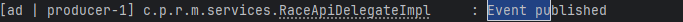

# PMU Horse Race Application

## Prerequisites

- Install JDK 21
- Install Maven 3.9.x
- Install Docker

## How to build
Run this command:
```
mvn clean package
```
## How to run
1- Start postgresql database container and kafka server container in order to prepare a local environment that could ensure doing end-to-end tests

Run this command:

```
pmu-dev-tools/docker/startAll.sh
```

2- Start the main SpringBoot Application com.pmu.race.manager.HorseRaceManagerApplication

## API documentation
#### Create a new horse race

```http
  POST /pmu/api/v1/race
```

| Request Body | Type   | Description                  |
|:-------------|:-------|:-----------------------------|
| `race`       | `Race` | **Required**. Race to create |

Request sample:

```json
{
  "name": "Race 1",
  "plannedAt": "2024-09-30",
  "numberAtDay": 3,
  "horses": [
    {
      "name": "Horse 1"
    },
    {
      "name": "Horse 2"
    },
    {
      "name": "Horse 3"
    }
  ]
}
```

| Response Body | Type   | Description  |
|:--------------|:-------|:-------------|
| `race`        | `Race` | Created race |

Response sample:

```json
{
  "name": "Race 1",
  "id": 1,
  "plannedAt": "2024-09-30",
  "numberAt": 3,
  "horses": [
    {
      "name": "Horse 1",
      "numberInRace": 1,
      "id": 1
    },
    {
      "name": "Horse 2",
      "numberInRace": 2,
      "id": 2
    },
    {
      "name": "Horse 3",
      "numberInRace": 3,
      "id": 3
    }
  ]
}
```

## TODO

- Handling Controller Exceptions (Add @ControllerAdvise)
- Review Avro schema
- Complete unit and integration tests
- In local env, docker couldn't be started because of wsl2 update. So, only integration tests were done to validate the implementation.
- In the following image, the log indicating that a new race has been pushed to Kafka topic (generated by RaceManagerIT test)
